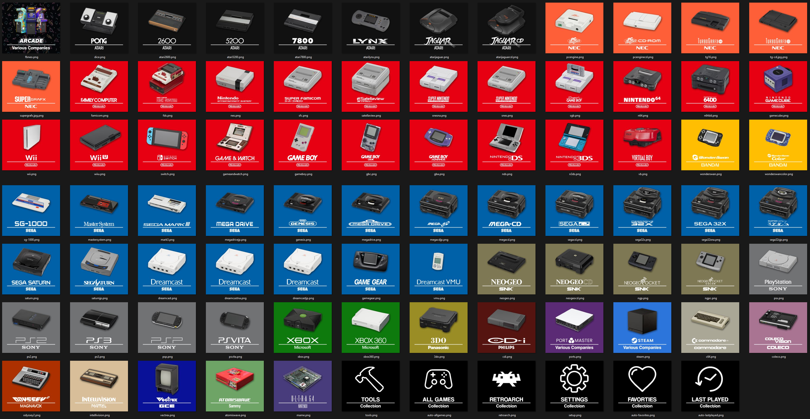

System Icons for use in NeoStation, in 8:7 aspect ratio.  I went mostly with ES-DE naming conventions that prioritizes European systems, like SNES with North American version being SNESNA.

I personally use FinalBurnNeo for arcade, using Mame only for a handful of games, so my Mame image plays favorites.

Not every system is covered, I simply did the ones I wanted to use and if I did at least one system from a company, I tried to finish out the rest.

For background colors, I defaulted to color of original branding with some liberties taken.  Bandai WonderSwan I didn't want to just be another red, so I pulled a color from the more recent Bandai Namco logo.  For 3DO, I just used the only color from the original console that wasn't just grey or black.  There was some method to the madness, but only so much.

Logos pulled from NSO Menu Interpreted (ES-DE Version)
https://github.com/anthonycaccese/nso-menu-interpreted-es-de

System photos pulled from Evan Amos's Vanamo Online Game Museum
https://commons.wikimedia.org/wiki/User:Evan-Amos

System photo for Arcade was pulled from NSO Menu Interpreted (ES-DE Version).

Settings related icons mostly sourced from the Switch theme included with ArkOS with additions to fill out gaps.

When anything was unavailable at either source, I either Photoshopped an existing image from the Vanamo Online Game Museum or found something usable elsewhere online via search to use a a base.

Unfortunately for those items, I didn't keep any sort of record where those items were pulled from.

Feedback welcome, but no guaratees on updates.
